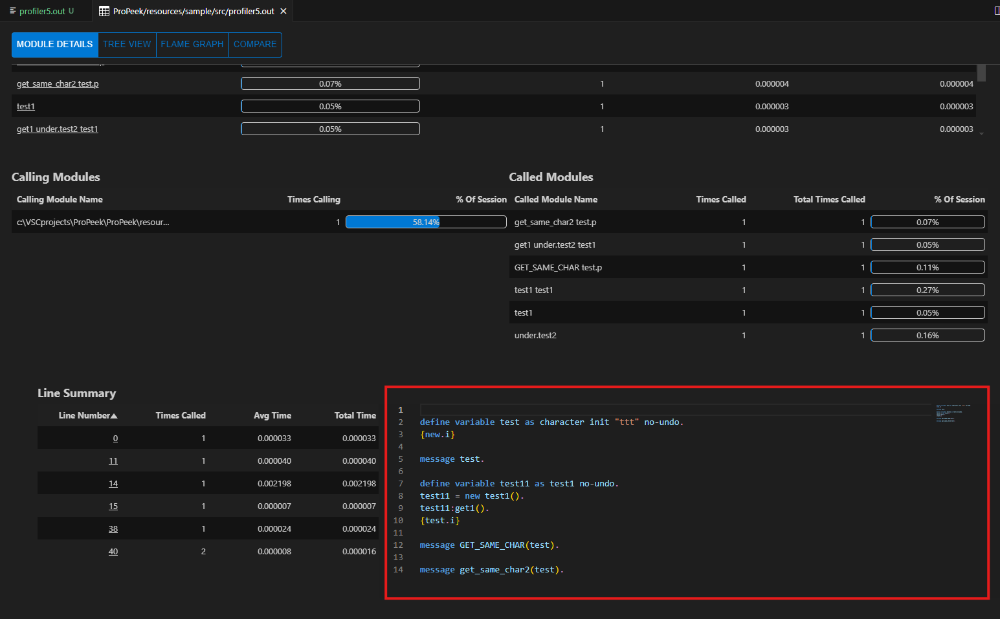
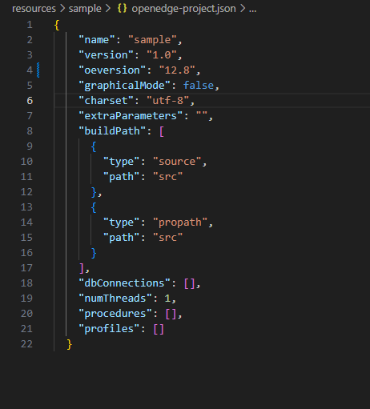

# ProPeek

An extension for Progress Openedge Profiler.

## Current status

This open source project is in active development. Our goal is to simplify the access to Progress Openedge Profiler when using VS Code as a development environment.

## Opening instructions

There are 3 option how to open view:

- In file explorer right click profiler file and select "Show Profiler"
- In open profiler file right click and select "Show Profiler"
- In open profiler file click this icon  on the top right corner


## Features

- Load and view _.prof_ and _.out_ profiler file
  - View Module details.
    - Jump to code.
    - Jump to line.
    - Jump to listings file (_New_).
  - View Calling module details.
  - View Called module details.
  - View Line Summary.
  - View Code in Monaco Editor by clicking on modules.
- Treeview.
- Flamegraph.
  - Ability to sort out procedure names by text.
  - Ability to sort out by constructor and destructor.
  - Ability to toggle graph type.
- Compare tab for multiple profilers.
  - Fast switch between profilers.
  - Ability to see difference in percentage.
  - View Calling module details difference.
  - View Called module details difference.
- Profiler Start/Stop Snippets.

## Instructions to activate Code View and Jump to Code



To be able to use Monaco Editor or jump to code feature you have to create openedge-project.json file in root of your project.



### Example `openedge-project.json`:

```json
{
  "name": "sample",
  "version": "1.0",
  "oeversion": "12.8",
  "graphicalMode": false,
  "charset": "utf-8",
  "extraParameters": "",
  "buildPath": [
    {
      "type": "source",
      "path": "src"
    },
    {
      "type": "propath",
      "path": "src"
    }
  ],
  "dbConnections": [],
  "numThreads": 1,
  "procedures": [],
  "profiles": []
}
```

## Related work

- [vscode-abl](https://github.com/chriscamicas/vscode-abl) a VSCode plugin for ABL.
- [ProBro](https://github.com/BalticAmadeus/ProBro) a VSCode plugin for browsing Progress Openedge Database.

## Sponsored by [Baltic Amadeus](https://www.ba.lt/en)

[](https://www.ba.lt/en)

**Enjoy!**
