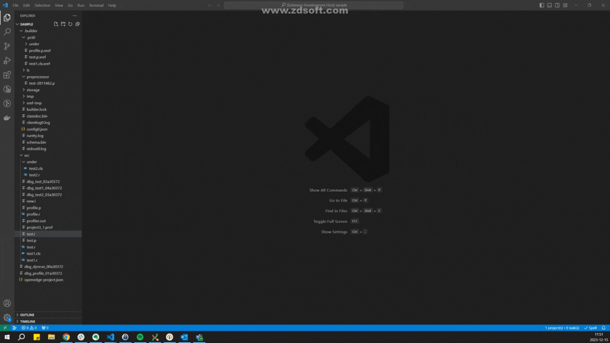

# ProPeek

An extension for Progress Openedge Profiler.

## Current status

This open source project is in active development. Our goal is to simplify the access to Progress Openedge Profiler when using VS Code as a development environment.

## Opening instructions

there is 3 option how to open view:

- In file explorer right click profiler file and select "Show Profiler"
- Right click in open profiler file and select "Show Profiler"
- In open profiler file click this icon  on the top right corner

## Features

- Load and view .prof profiler file
  - View Module details.
  - View Calling module details.
  - View Called module details.
  - View Line Summary.
- Treeview.
- Flamegraph.
  - Ability to sort out procedure names by text.
  - Ability to sort out by constructor and destructor.
- Profiler Start/Stop Snippets.

## Related work

- [vscode-abl](https://github.com/chriscamicas/vscode-abl) a VSCode plugin for ABL.
- [ProBro](https://github.com/BalticAmadeus/ProBro) a VSCode plugin for browsing Progress Openedge Database.

## Sponsored by [Baltic Amadeus](https://www.ba.lt/en)

**Enjoy!**
