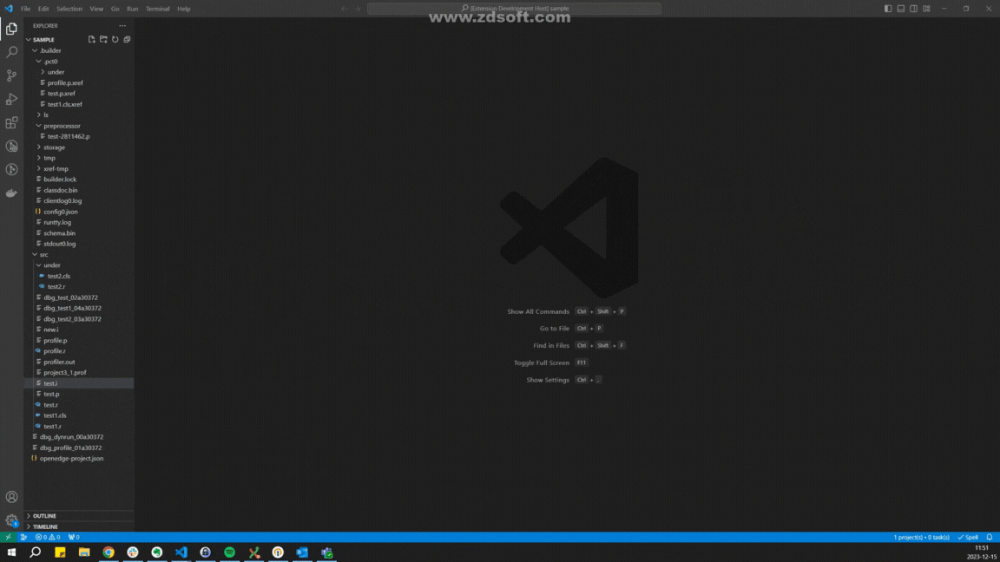
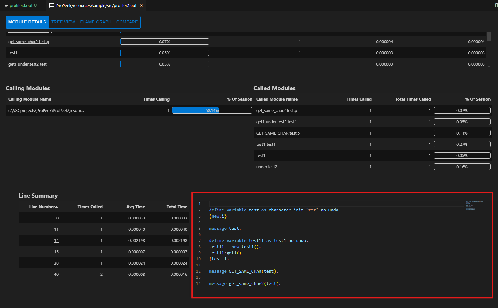

# ProPeek

An extension for Progress Openedge Profiler.

## Current status

This open source project is in active development. Our goal is to simplify the access to Progress Openedge Profiler when using VS Code as a development environment.

## Opening instructions

There are 3 options how to open view:

- In file explorer right click profiler file (.prof or .out file extension) and select "Show Profiler"
- In open profiler file right click and select "Show Profiler"
- In open profiler file click this icon  on the top right corner



## Features

- Module Details.
  - Lists all modules (internal procedures, methods, functions and triggers) with call counts, total time and average time per call.
    - Double click a module name to open its source code or listing file; modules that can be opened are underlined.
    - Source/Listing toggle controls how code is displayed (see Code View section below).
  - View Calling/Called module details.
  - View Line Summary per module. Double click a line number to open the listing file at that exact line.
  - View selected module's code in the built-in code editor with ABL syntax highlighting.
- Tree View.
  - Jump from node to Module Details (double click) or directly to code (CTRL + left click).
- Flame Graph.
  - View module call tree displayed as a flame graph.
  - Filter modules by specific text or constructors and destructors.
  - Toggle graph type between Summary (generated from CallTree section) and Detailed (Tracing section).
  - Jump from node to Module Details (double click) or directly to code (CTRL + left click).
- Call Graph.
  - View relationship between modules visualized in a call graph.
  - Switch graph node display between methods, classes or packages.
  - Filter the graph by setting display threshold.
  - Jump from node to Module Details (double click) or directly to code (CTRL + left click).
- Compare tab for multiple profilers.
  - View differences between each module.
  - Switch between profilers.
  - Ability to see difference in percentage.
- Profiler Start/Stop Snippets.

## Instructions to activate Code View and Jump to Code



The **Source/Listing** toggle controls how code is opened and displayed:

### Listing display

Shows the compiled code captured in **listing files**.

- Requires the profiler to be generated together with listing files. Listing files must be located either in directory specified by profiler:directory attribute or under the `~/listing/` directory of the current workspace.
- Line Summary line numbers correspond exactly to listing file lines, so double clicking a line number opens the listing at that position.

### Source display

Shows the real ABL source files of your project, positioned exactly on the selected procedure using compiler-generated cross-reference (**xref**) data.

- Requires both of the following:
  - the _.prof_ file to be opened from your project directory, which must contain an `openedge-project.json` file defining the build path (PROPATH) where your sources live, and
  - xref files generated during compilation (found under `.builder/.pct*/...` or `xref/...` inside your project directory).

If neither option is available for a given module, it cannot be opened and no code is displayed for it.

### Example `openedge-project.json`:

```json
{
  "name": "sample",
  "version": "1.0",
  "oeversion": "12.8",
  "graphicalMode": false,
  "charset": "utf-8",
  "extraParameters": "",
  "buildPath": [
    {
      "type": "source",
      "path": "src"
    },
    {
      "type": "propath",
      "path": "src"
    }
  ],
  "dbConnections": [],
  "numThreads": 1,
  "procedures": [],
  "profiles": []
}
```

## Related work

- [vscode-abl](https://github.com/chriscamicas/vscode-abl) a VSCode plugin for ABL.
- [ProBro](https://github.com/BalticAmadeus/ProBro) a VSCode plugin for browsing Progress Openedge Database.

## Sponsored by [Baltic Amadeus](https://www.ba.lt/en)

[](https://www.ba.lt/en)

**Enjoy!**
